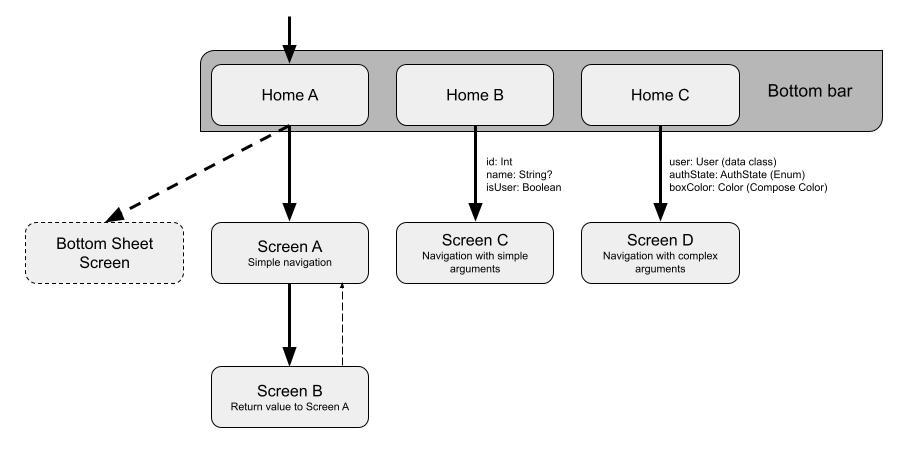

# Compose Navigation libraries comparison (16/01/2024)

## POC Ideal Scenario

The following requirements were defined for the POC, in order to assess multiple use cases that might be useful on the application:

1. Simple navigation to a screen without arguments\*

2. Navigation to a screen with primitive arguments\*

3. Navigation to a screen with complex arguments\*

4. Lateral navigation with bottom bar\*

5. Passing global data/states to the screens (e.g. top bar state)

6. Return values to previous screen

7. Deeplink support

8. Built-in bottom sheet

9. Customise navigation animations

\* Mandatory requirements

### Proposed solution

For each library an app module was created where the ideal scenario is implemented, as possible, considering the following structure:

## Libraries

### Compose Destinations

Compose Destinations ([Documentation](https://composedestinations.rafaelcosta.xyz/) / [Code](https://github.com/raamcosta/compose-destinations)) is a library that aims to make Compose Navigation easier, without weak typed arguments or all the boilerplate needed in the official library. It uses the official Jetpack Compose Navigation under the hood and abstracts/extends it with code generation based on annotations.

#### Ideal Scenario accomplishment

|          |           |                                                                                                                                                                                                                                                                                                                                                                                                                                                                                                                                                                                                                                                                                                          |
|----------|:---------:|----------------------------------------------------------------------------------------------------------------------------------------------------------------------------------------------------------------------------------------------------------------------------------------------------------------------------------------------------------------------------------------------------------------------------------------------------------------------------------------------------------------------------------------------------------------------------------------------------------------------------------------------------------------------------------------------------------|
| Scenario | Supported | Description                                                                                                                                                                                                                                                                                                                                                                                                                                                                                                                                                                                                                                                                                              |
| 1.       |     ✅     | After annotating a composable with _@Destination_ and running code generation, a _\*\*Destination_ class is generated. The invoke operator of that class can used to create a _Direction_ that can be passed to the _navigate_ function of the _DestinationsNavigator_ or _NavController_ (_DestinationsNavigator_ abstracts the usage of _NavController_ so it is more recommended to be used, when possible).                                                                                                                                                                                                                                                                                          |
| 2.       |     ✅     | The arguments can be defined on the composable parameters definition (e.g. _id: Int_ is considered a mandatory argument of that screen). The arguments can be mandatory or optional (with or without default value). _String_, _Boolean_, _Int_, _Long_ and _Float_ are the basic types that can be used for arguments. The arguments can be passed on the _invoke_ operator of the class that is generated for that destination. As an alternative, it is possible to configure the arguments on a separate class, which can be pointed in the _navArgsDelegate_ parameter of the Destination annotation. That class can then be obtained from the _SavedStateHandle_ (from the ViewModel for example). |
| 3.       |     ✅     | Passing complex arguments is fundamentally similar, but some custom types might need extra setup. _Enums_, _Parcelable_, _Serializable_ and _Array/ArrayList_ are natively supported by the library and can be used as arguments without extra setup (like the basic argument types). If a different custom type is needed, a _@NavTypeSerializer_ needs to be defined with the parse from/to String (an example can be found on the POC for the Compose _Color_).                                                                                                                                                                                                                                       |
| 4.       |     ✅     | Considering the previous points, it is not hard to set up lateral navigation (e.g. bottom bar). The library has some helper extension functions that makes it easier to get the current _Direction_ in order to know which bottom bar item to select. The _NavController_ can then be used with the usual lateral navigation options.                                                                                                                                                                                                                                                                                                                                                                    |
| 5.       |     ✅     | The _DestinationsNavHost_ is used to render a _NavGraph_ (usually the root graph). The _dependenciesContainerBuilder_ parameter of that composable can be used to inject any dependency on the destinations’ composable. The dependency can be provided for the entire graph or for specific destinations/graphs only. It can be used to pass for example a TopBarState/BottomBarState/SnackbarHost/etc, shared ViewModels or any other dependency that might be useful on the destinations.                                                                                                                                                                                                             |
| 6.       |     ✅     | The library has built-in support for returning values to the previous screen. The _ResultBackNavigator_ can be used to navigate back with a result. On the other side, the _ResultRecipient_ (with the Destination where the result is coming from and the type of the result) can be used to get the returned value on the previous screen. Both are automatically provided by the library and only need to be defined on their respective composable’s parameters.                                                                                                                                                                                                                                     |
| 7.       |     ✅     | The deeplinks of a destination can be defined on the _Destination_ annotation through the _deepLinks_ parameter. When the constant _FULL\_ROUTE\_PLACEHOLDER_ is used, the library replaces that segment of the deeplink by the route with the arguments. It is also possible to define the route and arguments manually on the deeplink uriPattern.                                                                                                                                                                                                                                                                                                                                                     |
| 8.       |     ✅     | The library has built-in support for bottom sheets, which can be treated as destinations. By applying the _style_ _DestinationStyleBottomSheet_ to a composable, it will be rendered as a bottom sheet when calling _navigate_. It also supports Dialogs by applying the style _DestinationStyle.Dialog_.                                                                                                                                                                                                                                                                                                                                                                                                |
| 9.       |     ✅     | By default, the navigation between screens does not have animation. The default animation can be defined in the _NavHostEngine_ that can be passed to the _DestinationsNavHost_. Alternatively, the animations can be defined for specific destinations, by creating a custom style that extends _DestinationStyle.Animated_.                                                                                                                                                                                                                                                                                                                                                                            |

#### Pros

- Great documentation

- Easy to set up and use

- Supports a lot of useful cases (bottom sheet, dialog, global states, etc.)

- Flexibility

- Allows the injection of dependencies for the screens

- Regular and good maintenance

- A second version (v2) of the library is being prepared and might be released on the first quarter of 2024 with some improvements

#### Cons

- Some parts of the documentation are outdated for the current version (v1.9.57) of the library (according to the author, the documentation will be renewed with the release of v2)

- Since it relies on KSP for code generation, the code generation (or project build) needs to be executed when changes to the destinations/graphs are applied, which can get a bit annoying over the time

- Since it uses Jetpack Compose Navigation under the hood, there can be some limitations of the official library that also applies to this library, even though it does a great job working around those limitations

- Might need some extra setup for multi-module projects and can be hard to work with if the feature modules do not depend on each other

- Even though it provides a _DestinationsNavigator_ that abstracts _NavController_, it can still be hard to test

### Decompose

Decompose ([Documentation](https://arkivanov.github.io/Decompose/) / [Code](https://github.com/arkivanov/Decompose)) is a Kotlin Multiplatform library that allows the implementation of a component based architecture, through a component tree. This architecture is an alternative to MVVM, where a “Component” holds the business logic and the UI is pluggable (it is compatible with multiple UI frameworks, like Compose, Android Views, SwiftUI, Kotlin/React, etc.). The components are lifecycle-aware and are retained over configuration changes. The library brings support for different types of navigation (the most common being stack navigation) and has a good level of customisation on how the navigation works.

#### Ideal Scenario accomplishment

|          |           |                                                                                                                                                                                                                                                                                                                                                                                                                                                                                                                                                                                                                                                                                                                                                                                                                |
|----------|:---------:|----------------------------------------------------------------------------------------------------------------------------------------------------------------------------------------------------------------------------------------------------------------------------------------------------------------------------------------------------------------------------------------------------------------------------------------------------------------------------------------------------------------------------------------------------------------------------------------------------------------------------------------------------------------------------------------------------------------------------------------------------------------------------------------------------------------|
| Scenario | Supported | Description                                                                                                                                                                                                                                                                                                                                                                                                                                                                                                                                                                                                                                                                                                                                                                                                    |
| 1.       |     ✅     | With this library, a _RootComponent_ can be created to represent the whole app. This component will hold the main navigation stack. On a _Config_ sealed class, the different child components (in this case screens or other screen aggregator components) that can be used on the stack are defined. After creating the _StackNavigation_, the _ChildStack_ can be created. While the _StackNavigation_ can be used to do operations on the stack (e.g. _push_ or _pop_), the _ChildStack_ exposes the stack with the child components so that their UI can be constructed. In order to perform a navigation between two screens, the methods _push_ or _pushNew_ (to avoid duplicate screen creation) of _StackNavigation_ can be used, passing the configuration file of the destination component/screen. |
| 2.       |     ✅     | Considering the previous point, in order to pass arguments they can simply be added to the Configuration class of that component. This way, the parameters need to be passed (if they are mandatory) when the Configuration instance is created to perform the navigation. Usually the _StackNavigation_ is confined to its component and the navigation operations are provided to the child components through anonymous functions.                                                                                                                                                                                                                                                                                                                                                                          |
| 3.       |     ✅     | Since the Configuration sealed class for the _StackNavigation_ needs to be Parcelable or Serializable, complex objects can be passed as arguments, as long as they are Parcelable or Serializable, respectively. It is possible to use other custom types, but it requires a more complex setup of the stack.                                                                                                                                                                                                                                                                                                                                                                                                                                                                                                  |
| 4.       |     ✅     | Even though it is not so straight-forward, it is possible to create a BottomBar with lateral navigation using Decompose. The _ChildStack_ being observed on Compose can be used to define the selected item of the bottom bar. To navigate between the bottom bar screens, a function can be exposed on the _RootComponent_ where the lateral navigation is performed (the usual Android lateral navigation can be achieved by popping the stack until the index 0 and then pushing the new screen if it is not the initial one).                                                                                                                                                                                                                                                                              |
| 5.       |     ✅     | It is possible to pass global states/objects to the child composables when they are being defined on the root component UI. If the tree has multiple levels, those objects can be passed in the constructor of the _RootComponent_ and then passed down along the component tree.                                                                                                                                                                                                                                                                                                                                                                                                                                                                                                                              |
| 6.       |    ☑️     | There is no direct support for values being returned to previous screens, but since the components work as a tree, the two child components/screens will always have a common parent component. A Value/State/Flow can be used on the parent component to hold the returned value, which can then be used on the previous screen.                                                                                                                                                                                                                                                                                                                                                                                                                                                                              |
| 7.       |     ❌     | The library has no built-in support for deeplinks.                                                                                                                                                                                                                                                                                                                                                                                                                                                                                                                                                                                                                                                                                                                                                             |
| 8.       |     ❌     | The library has no built-in support for bottom sheets or dialogs. However it provides a _SlotNavigation_ that can be useful when trying to implement bottom sheets or dialogs. It is a type of navigation that has no stack and only one slot is available for the components.                                                                                                                                                                                                                                                                                                                                                                                                                                                                                                                                 |
| 9.       |     ✅     | The navigation animations can be defined on the _Children_ composable that is used to render the stack. By using the _animation_ parameter it is possible to define the specifications for any navigation. It is also possible to define different animations for different child components on that parameter.                                                                                                                                                                                                                                                                                                                                                                                                                                                                                                |

#### Pros

- Good separation between business logic and UI

- More testability

- Pluggable with different UI frameworks/SDKs

- Regular and good maintenance

#### Cons

- Enforces the usage of Component based architecture

- Hard to integrate with DI frameworks (specially Hilt)

- Weird recompositions behaviour during the navigation between screens (probably caused by the animations)

- Relies on multiple _when_ clauses that can get bigger and bigger as the project starts to get more complex (each stack navigation needs a _when_ clause for creating the child Component and another to render the respective composable for that child)

- The global states need to be passed manually to each child composable. In case the tree structure is more complex, those states need to be passed down the tree so that they can be used on the leaf components

- The terminology can bring some confusion, since the Components (that hold the business logic) are different from the UI components (reusable UI composables)

- Does not have a built-in deep link system

### Voyager

Voyager ([Documentation](https://voyager.adriel.cafe/) / [Code](https://github.com/adrielcafe/voyager)) is also a multiplatform library that focuses only on navigation for Compose. Even though it was created for multiplatform, it can be easily integrated on Android and has a lot of support for Android-specific technologies.

#### Ideal Scenario accomplishment

|          |           |                                                                                                                                                                                                                                                                                                                                                                                                                                                                                                                                                                                                                                                                              |
|----------|:---------:|------------------------------------------------------------------------------------------------------------------------------------------------------------------------------------------------------------------------------------------------------------------------------------------------------------------------------------------------------------------------------------------------------------------------------------------------------------------------------------------------------------------------------------------------------------------------------------------------------------------------------------------------------------------------------|
| Scenario | Supported | Description                                                                                                                                                                                                                                                                                                                                                                                                                                                                                                                                                                                                                                                                  |
| 1.       |     ✅     | The screens are created by implementing the interface _Screen_ and its composable function _Content()_. When the screen has no arguments, the interface can be implemented on a simple _class_ with an empty constructor or on an _object_ (usually the object is used for tabs or bottom bar screens).On the Main Activity, the _Navigator_ composable can be used (with the initial screen) to render the screens. Inside the screen composables, the navigator can be obtained through _LocalNavigator.currentOrThrow_ and then navigate to a screen using the _push_ function (passing the screen instance).                                                             |
| 2.       |     ✅     | When the screen has arguments, the _Screen_ interface can be implemented on a _data class_, where the arguments are specified on the constructor. Then those arguments can be passed when the data class instance is being initialised before being pushed on the navigator.                                                                                                                                                                                                                                                                                                                                                                                                 |
| 3.       |     ✅     | Complex arguments can also be defined on the constructor but it needs special attention. By default, the screen state is stored in the Bundle so that it can be restorable. Because of that, the arguments of the Screen need to be either Java Serializable or Parcelable.If state restoration is not intended, it is possible to [disable](https://github.com/adrielcafe/voyager/issues/63#issuecomment-1529771487) it and then any type of argument can be sent (it is possible to have any type of argument even without disabling the state restoration but it leads to a crash/runtime exception every time the application is sent to the background on that screen). |
| 4.       |     ✅     | By using the property _lastItem_ of the _Navigator_, it is possible to know what is the current screen and select on the bottom bar.There is no built-in function that already does lateral navigation, but it is easy to achieve by popping the stack until the size is 1 and then pushing the screen if it is not the initial.                                                                                                                                                                                                                                                                                                                                             |
| 5.       |     ❌     | Since the Screens are independent and abstract, there is no way to pass global states/data to them (even manually) from the Navigator.But it is quite easy to provide those states using the Compose mechanism that the library uses to provide most of its components (including the _Navigator_). By using _CompositionLocalProvider_ it is possible to provide global states (like TopBarState or BottomBarState) to the screens.                                                                                                                                                                                                                                         |
| 6.       |     ❌     | Because of the same reason as the previous point, there is no built-in approach to return values to previous screens. It needs to be achieved through other ways (e.g. using Flow)                                                                                                                                                                                                                                                                                                                                                                                                                                                                                           |
| 7.       |     ❌     | The library has no built-in deep link system.However, it has a feature that helps when implementing a custom deep link system: it is possible to create an initial stack with multiple screens at once. It allow the creation of the stack with the usual path to a screen when creating the deep link for it.                                                                                                                                                                                                                                                                                                                                                               |
| 8.       |     ✅     | In order to use bottom sheets, a _BottomSheetNavigator_ needs to be defined around the normal _Navigator_. It can then be obtained on the screens through _LocalBottomSheetNavigator.current_. The function _show_ can be used to show the bottom sheet screen.The bottom sheets are still experimental in the library and have some inconsistencies.                                                                                                                                                                                                                                                                                                                        |
| 9.       |     ✅     | The library provides some pre-built animations/transitions like _FadeTransition_, _SlideTransition_ and _ScaleTransition_. Those transitions need to be used around the navigator content. It is also possible to create custom transitions by using _ScreenTransition_.It is more difficult to define transitions for specific screens, but it is possible by creating a custom transition that looks at the navigator's last item.                                                                                                                                                                                                                                         |

#### Pros

- Simple to set up and use

- Depending on the state restoration, it is possible to work with any type of argument (or at least with Java Serializable or Parcelable)

- Supports Android ViewModels. If targeting Multiplatform, it is possible to use _ScreenModel_, which is similar to the Android ViewModels

- Easy to integrate with Jetpack Hilt (Android only) and others DI frameworks like Koin or Kodein (Multiplatform)

- Has a built-in system to provide the screens on multi-module projects where the feature modules do not depend on each other

- No need for exhaustive definition of the screens (no need for big _when_ clauses)

- Has built-in support for tab navigation

#### Cons

- Its first stable version was released recently (10th December of 2023)

- Needs some extra setup for multi-module projects

- Weird recompositions behaviour during the navigation between some screens (probably caused by the animations)

- _BottomSheetNavigator_ is still experimental and is not very flexible

- No support for shared ViewModels

- Does not support kotlinx.serialization for the screen/state restoration

### Other libraries

Other Compose navigation libraries were on the table, but they were discarded because are less used and/or they have not been maintained for a long time:

- [Appyx](https://github.com/bumble-tech/appyx)

- [compose-navigation-reimagined](https://github.com/olshevski/compose-navigation-reimagined)

- [navigator-compose](https://github.com/KaustubhPatange/navigator/tree/master/navigator-compose)

- [simple-stack-compose-integration](https://github.com/Zhuinden/simple-stack-compose-integration)
